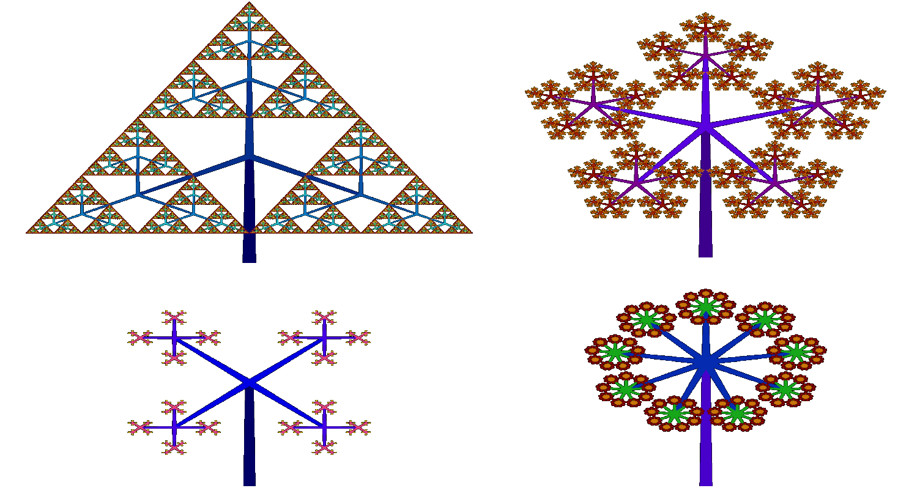

# Tree Fractal Generator
A full tree fractal GUI program utilizing ROOT libraries,
and includes a random tree generator. 

Requires CERN's ROOT library to be installed:
https://root.cern.ch/download/root_v6.14.04.source.tar.gz

The program may be compiled in the terminal using the following bash script:

./compile.sh

which should open a GUI for the user.

## Program Description
* A complete description of the program may be found <a href="https://freddyox.github.io/blog/tree-fractal-v2/">within my website</a>, and a small video may be found <a href="https://www.youtube.com/watch?v=yIIv5fRgoSY&feature=youtu.be">here</a>. 
* Program originally was designed to generate symmetric Pythagorean fractal trees, where the number of branches, angles, lengths, etc. could be adjusted by the user; however, a natural extension to a apply random fluctuations which results in trees that look more natural.
* In the context of symmetric trees, if one chooses the angles/lengths properly the outputs become very surprising, *e.g.* I was able to replicate a variation of the Sierpinski Triangle among other structures. 
* I added options to change the color palette, which automatically applies (and dynamically updates) a pretty color gradient based on the iteration number of the fractal.

#### Symmetric Outputs:
* Going clockwise and starting at the top left, the number of branches to generate at a new node is 2, 3, 4, 5, and 9:

* Here is a cool gif that I made a long time ago. This is a symmetric tree where two branches are constructed at each node, and the branch angle is adjusted from [0,360] degrees; this produces 360 images which are then strung together to create a gif:

